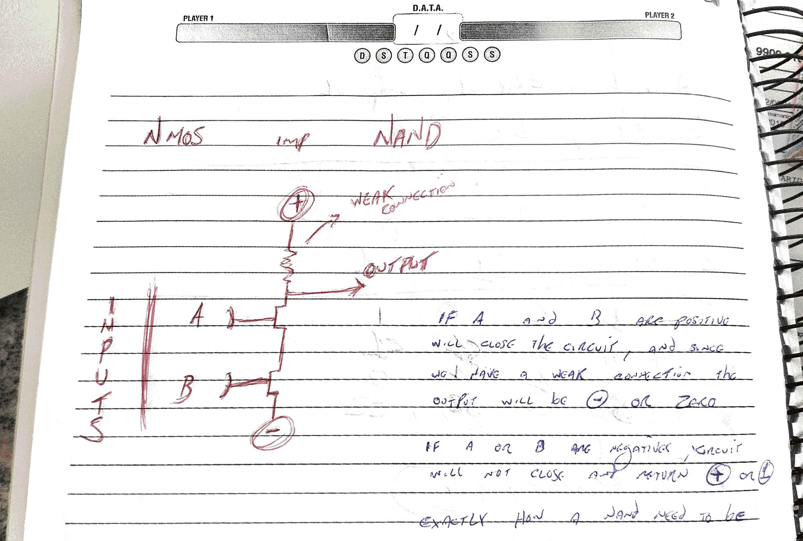
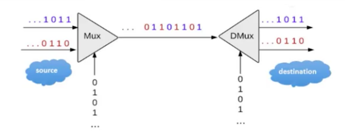

## Nand To Tetris

While learning a new programming language, we don't worry about the "how", just with the "what". when we see a code using print, actually p is a number for the computer, r is another number, and we listen about compilers and so on but we don't worry about that. Something need to make some pixels dark and other pixels light to write a HELLO in the screen, but we don't ask "how" just the "what". Thats the abstraction of a programming language, that help us.

### Bit e Byte
Bit é a menor unidade de informação que pode ser transmitida, podendo ter apenas dois valores, 0 ou 1, corte ou passagem de energia. Geralmente trabalhados em múltiplos de bits, os bytes. No começo os bytes tinham tamanhos variáveis, mas foi definido seu uso em octetos, 8 bits. b minúsculo é para representar bit. B maiúsculo é para representar Bytes, como em kB, MB, GB, TB.

Fisicamente o bit é armazenado como uma carga elétrica acima ou abaixo de um padrão determinado dentro de um capacitor dentro de um dispositivo de memória. Mas podem ser representados fisicamente por outros meios.

### Unit 1.1 Boolean algebra
-Truth Table
-Commutative laws - expressions that have the same value
-Associative laws - expressions where doesn't matter the order of the variables. We can change the parenthesis.
(X OR (Y OR Z)) = ((X OR Y) OR Z)
-Distributive Laws - Open a expression (X OR (Y AND Z)) = (X OR y) AND (X OR Z)
-De Morgans Law  / NOT(x AND y) = NOT(x)  OR NOT(y) / NOT(x OR y) = NOT(x) AND NOT(y)
-Idempotence Law - NOT(x) AND NOT(x) = NOT(x)
-Double Negation law - NOT(NOT(x)) = x / NOT(NOT(y)) = y

### Unit 1.2 Truth Table to Boolean Expression
-Get all the rows that have 1 as result, and write a expression that only return one in this row.
- Do that for each row that have 1 as result.
- After that, put all the expressions construct above together with a OR
- Try to simplify the Boolean expression

-We saw that we only need OR, AND and NOT to construct any boolean function
-But we can apply De Morgan Law and do not need the OR operator anymore, So, we just need AND and NOT to construct any boolean function
- We can reduce even more? No without know a new Operator - NAND

- NAND operator - Negation of AND
-And Now we can construct everything with NAND operator / That will be our atomic building block for this system.
You can construct systems using the other gates, but the NAND became popular because was cheap to build.

This course start from the NAND, and you don't need to implement it. It is already done.
Implement a NAND is out of the computer science field, and more in the electronic area.
But here I draw how to implement the NAND using NMOS implementation.

### Unit 1.3 Gate Logic
- A Logic gate is a simple chip build to deliver a functionality, like OR, AND, NAND and so on.
- Composite logic gate

- Circuit Implementations - Electrical engineering 

### Unit 1.4 HDL - Hardware description Language

- The interface is unique, and the implementations varies
VHDL, Verilog

### Unit 1.6
- Multi-bit - Buses (a latin world that mean many or something like that)
- Buses are index right to left a[0] - the most right , a[15] - the most left

### Unit 1.7

##### Multiplexor
- 3 inputs: A, B, Sel.
- If Sel == 0, then outputs A, else, if Sel == 1, outputs B.

##### Mux Logic Gates
- Gates that can behave like in one or several different ways. For example, a Gate that can behave like a AND gate or as a OR gate.

##### DeMultiplexor
- Inverse of the multiplexor
- Distribute the single input value, into one of two possible destinations.

### Unit 2.1 

Using the chipset that we've built in the previous module, we will now proceed to build a family of adders. Chips design to add numbers, and with that build an ALU, Arithmetic Logic Unit.

#### Binary numbers

##### Convert decimal to binary
1 0 1 = 1 x 2^2 + 0 x 2^1 + 1 X 2^0
1 1 0 1 = 1 x 2^3 + 1 x 2^2 + 0 x 2^1 + 1 x 2^0

##### Fixed Length / Word Size
Example: Limit 8 bits: (2^8) - 1 = 255
Actually, not, since we need to save one bit to represent negative numbers

So, 255 / 2 = 127 possibilities for positive numbers

#### Decimal to Binary

99 = 64 + 32 + 2 + 1
01100011

The max power, will be the size of the bits 2^8 = 64, so 8 bits.
If the result of the power, appears in the sum, you set 1, otherwise 0.
Example: 2^0 = 1. 1 is in the sum, So 1(binary)
Another example: 2^1 = 2. 2 is in the sum, So 1(binary)
Last example: 2^2 = 4. 4 is not in the sum, so 0(binary).
And so on...

#### Binary Addition

 0001 0101
+
 0101 1100
-----------

0 + 0 = 0
1 + 0 = 1
1 + 1 = 10
1 + 1 + 1 = 11

So...
 0001 0101
+
 0101 1100
 0111 0001 

##### Overflow
We just ignore any carry bit that does not fit into the word size.

#### Half Adder
adds two bits

#### Full Adder
adds three bits

#### Adder
Adds two numbers of any size

### Negative Numbers
2^bits length - 1 = possible number
but if we think about negative and positive numbers, we will reduce that to half possibilities

One way to represent negative number is using the first binary as the signal. But that is not a popular way, since we will have a negative 0, that is inelegant. And also if you try to manipulate them you will get in trouble.

Here is what people use. Something called 2's complement
2^n - x  (n = bits)

### Computing -x
Get the number, subtract from a number that is 1 in all spots, then add 1.
When you subtract from a number that is 1 in all spots, you just flip all the binarys.

To add 1, flip all the binarys from right to left til the first 0 becomes a 1.

### Arithmetic Logic Unit
John Von Neumann -> Von Neumann Architecture
