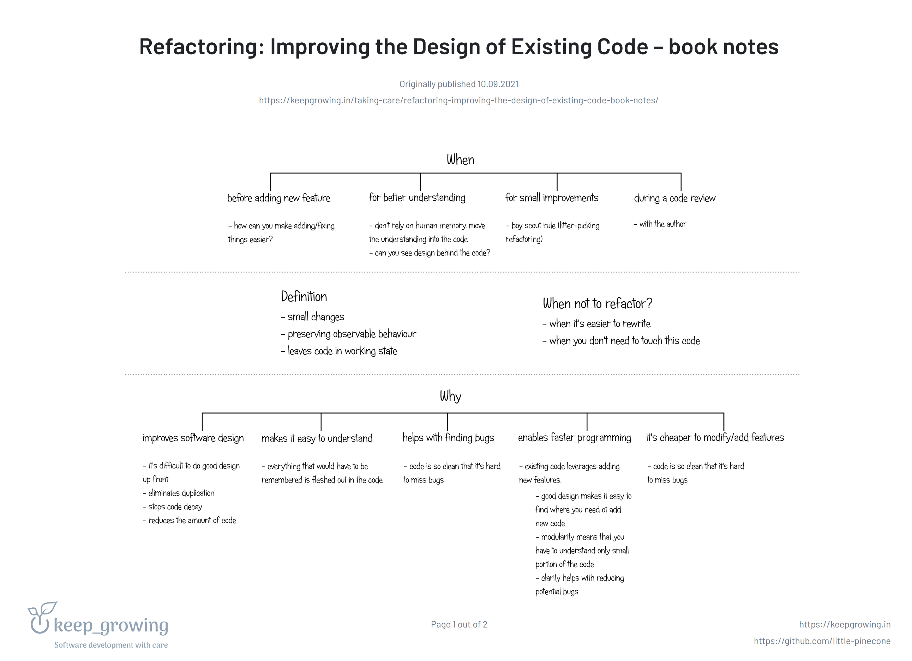
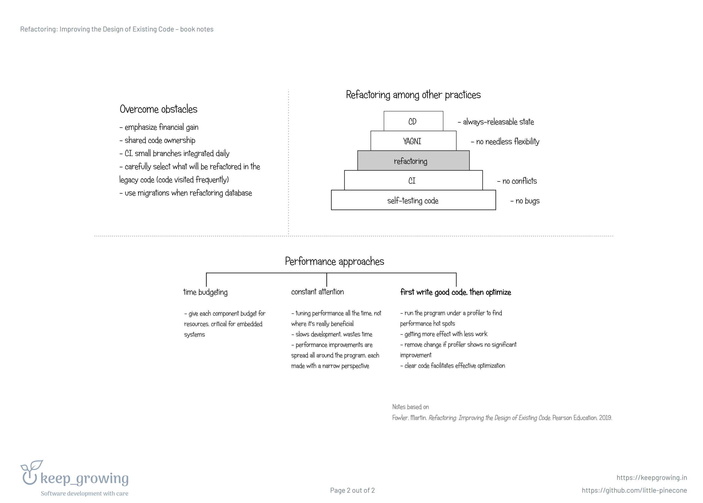

# Refactoring - Martin Fowler

 
 

-Any fool can write code that a computer can understand. Good programmers write code that humans can understand. 

-With refactoring, we can take a bad, even chaotic, design and rework it into well-structured code 

-If your refactoring introduces performance slow-downs, finish refactoring first and do performance tuning afterwards 

-Brevity is the soul of wit, but clarity is the soul of evolvable software 

-The true test of good code is how easy it is to change it 

-Before you start refactoring, make sure you have a solid suite of tests. These tests must be self-checking. 

-If all else is equal, more code is bad—but rarely is all else equal 

-The key to effective refactoring is recognizing that you go faster when you take tiny steps 

-If someone says their code was broken for a couple of days while they are refactoring, you can be pretty sure they were not refactoring 

-Without refactoring, the internal design—the architecture—of software tends to decay 

-Refactoring isn’t an activity that’s separated from programming—any more than you set aside time to write if statements 

-You have to refactor when you run into ugly code—but excellent code needs plenty of refactoring too 

-The decision to refactor or rewrite requires good judgment and experience 

-Some organizations do regular code reviews; those that don’t would do better if they did 

-If you want to refactor, you have to write tests 
