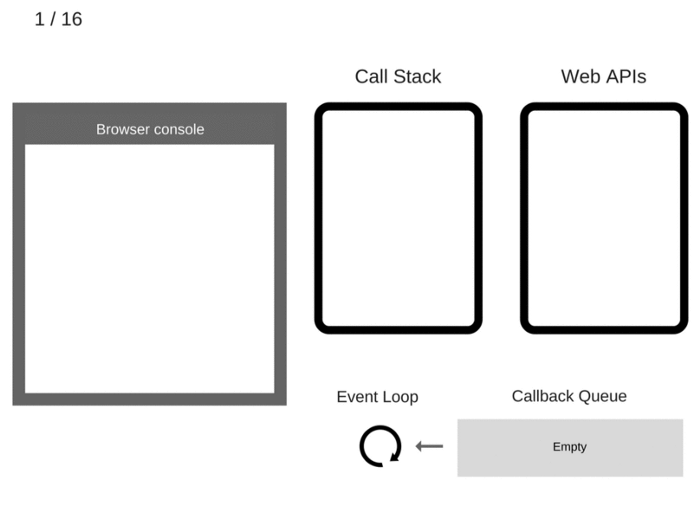

## Closures

Definition: 
- 1) A function that remember it lexical scope even been executed outside his lexical scope. 
- 2) A function that has access to its parent scope, even after the parent scope has closed.

```
function makeSizer(size) {
  return function() {
    document.body.style.fontSize = size + 'px';
  };
}

var size12 = makeSizer(12);
var size14 = makeSizer(14);
var size16 = makeSizer(16);

size12();
```

## Prototypes

Definition:
- 1) The mechanism by which javaScript objects inherit features from one another.
- 2) Every object in JavaScript has a built-in property, which is called its prototype. The prototype is itself an object, so the prototype will have its own prototype, making what's called a prototype chain. The chain ends when we reach a prototype that has null for its own prototype

When you try to access a property of an object: if the property can't be found in the object itself, the prototype is searched for the property. If the property still can't be found, then the prototype's prototype is searched, and so on until either the property is found, or the end of the chain is reached, in which case undefined is returned.

```
const myDate = new Date(1995, 11, 17);

console.log(myDate.getYear()); // 95

myDate.getYear = function() {
  console.log('something else!')
};

console.log(myDate.getYear()); // 'something else!'
```

This should be predictable, given the description of the prototype chain. When we call getYear() the browser first looks in myDate for a property with that name, and only checks the prototype if myDate does not define it. So when we add getYear() to myDate, then the version in myDate is called.

This is called "shadowing" the property.

## Async

Async was introduced in JavaScript ES8.
An easy way to work with Promises.

Await is only used with an async function

## Event Loop

Definition: Has one simple job. Monitor the call stack and the call back Queue.



## Microtasks

A way to manipulate single thread / Event Loop to run multiple things at time.

## Callbacks

Definition: A JavaScript callback is a function which is to be executed after another function has finished execution.

## Promises

Promises were introduced in JavaScript ES6.

### States of Promises
- Pending
- Resolved
- Rejected

## Debugging and profile your code -- Start using debugger -- V8 snapshots / Flamegraphs

## Webpack

Definition: Webpack is a tool that lets you compile JavaScript modules, also known as module bundler. Given a large number of files, it generates a single file (or a few files) that run your app.

##Babbel

Definition: Babel is a toolchain that is mainly used to convert ECMAScript 2015+ code into a backwards compatible version of JavaScript in current and older browsers or environments.


