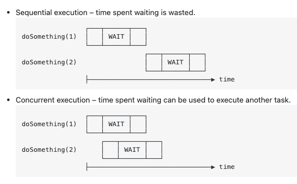

# JavaScript

## Execution Context

Memory component - Also know as variable environment, this memory component is responsable for store variables and functions as key-values pairs.

Code component - Also know as Thread of execution. Code component is the place where code is executed line by line.

Javascript is synchronous, single thread language. It can only execute one command at time and in specific order.

### Example 1

```
var a = 2;
var b = 4;

var sum = a + b;

console.log(sum);
```

Browser will execute the code in two phase. Memory and Code.
Javascript will scan thought all the code and allocate memory for all variables and functions.
Variables will be set as undefinied and for functions it will keep the entire code of the function.

In the second phase, it starts going thrhough the whole code line by line. As it encounters var a = 2, it assign it to the memory, the same for b. And then it calculate the sum and store it in the memory. It will print the sum and destroy everything.

### Example 2
```
var n = 2;

function square(num) {
 var ans = num * num;
 return ans;
}

var square2 = square(n);
var square4 = square(4);
```
It will work as in the example 1. When it face the function, it will allocated the function in the memory and jump to the next line.

When the function is called, Javascript will create a new memory/code context. For all the parameters and variables it will allocated memory as undefinied and the execute code line by line. Once the function returns the value, it will destroy that context.

Keep in mind that When a function is invoked in JavaScript, JavaScript creates an execution context. Execution context will get complicated as we nest functions inside a function.

---

- var -> Exists in all the code
- let -> Just exists in the block where it was definied
- const -> works exactly like let, but for constants

```
var i = "Valor Inicial de i";
for(let i=0;i<10;i++){
console.log('i inside for= '+i);
}
console.log('i outside for= '+i);
```

window.var_name -> works like a global scope 

---

#### Sum
```array.reduce((a,b) => a+b);```

#### Max
```array.reduce((a,b) => a>b?a:b);```

#### Min
```array.reduce((a,b) => a<b?a:b);```

#### Sort Asc
```array.sort((a,b)=>a-b);```

#### Sort Desc
```array.sort((a,b)=>b-a);```

### Remove False values from array
```array.filter(Boolean);```

---

### Short-circuit evaluation

#### The same thing as if (foo == 10) then doSomething();
```
let foo = 10;  
foo === 10 && doSomething();
```

#### The same thing as if (foo != 5) then doSomething();
```foo === 5 || doSomething();```

---

#### Spread
```
const arr = [1, 2, 3];
const arr2 = [...arr];
// [1, 2, 3]
```

```
const arr1 = [1, 2, 3];
const arr2 = [4, 5, 6];
const combined = [...arr1, arr2];
// [1, 2, 3, 4, 5, 6]
```

#### you can use Set to remove duplicate elements from the array
```
const numbers = [2,3,4,4,2,3,3,4,4,5,5,6,6,7,5,32,3,4,5]

//spreading numbers of the object into an array using the new operator
console.log([...new Set(numbers)]) 

// [2, 3, 4, 5, 6, 7, 32]
```

---

### Destructuring

```
//setting defaults on the individual values and the whole object works too
myFunc = function({x = 5,y = 8,z = 13} = {x:1,y:2,z:3}) {
    console.log(x,y,z);
};

myFunc(); //1 2 3  (hits the object literal default)
myFunc({}); //5 8 13   (hits the value defaults)
```

```
let myFunc = function({x = 5,y = 8,z = 13} = {}) {
    console.log(x,y,z);
};

myFunc({y:15,x:10,a:1}); //10 15 13
```

---

### Wait Performance

Let's assume I need to doSomething(1) and doSomething(2). Without async/await they'd execute one after another, leading to long latency. But with async, or equivalently with callbacks, the execution can be interleaved. Here's an illustration:



---

### Buffers
The Buffer class in Node.js is designed to handle raw binary data.

```
const buffer = Buffer.alloc(8);
// This will print out 8 bytes of zero:
// <Buffer 00 00 00 00 00 00 00 00>
```

```
// String to Base64
return Buffer.from(str).toString('base64');
```

```
// Base 64 to String Ascii
return Buffer.from(str, 'base64').toString('ascii');
```

---

### Generics

A way to keep some components / functions flexible for whom use it.
When you use any, you cant capture the type that was passed as parameter, you just have a any information.
With Generic type, you can capture the type.

```
function identity<Type>(arg: Type): Type {
  return arg;
}

let output = identity<string>("myString");
```

---

### Unknow versus any

- Unknow can just be unknow or any
- Any can be anything

---

### Shallow Copy versus Deep Copy

#### Shallow Copy
Both original object and cloned object internally point to the same referenced object, same memory address.

#### Deep Copy
avoiding shallow copy:

- Using spread operator
- Using Object.assign operator
- Using JSON.stringify and JSON.parse

##### SPREAD OPERATOR

Now, what a spread operator does? It deep copies the data if it is not nested. For nested data, it deeply copies the topmost data and shallow copies of the nested data.

```
const obj1 = {
  name: 'aa',
  age: {
    birth: '1985-11-14',
    int: 37
  },
  race: 'latin'
}

const obj2 = {...obj1};

obj1.name = 'bb';
obj1.age.int = 40;


console.log(obj2);
// { name: 'aa', age: { birth: '1985-11-14', int: 40 }, race: 'latin' }
```
